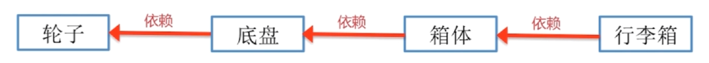
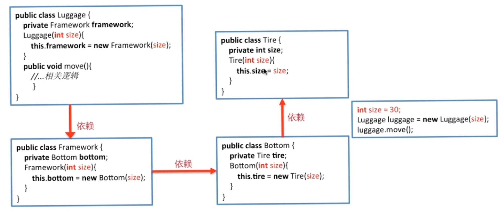
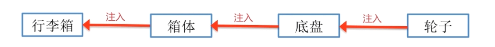
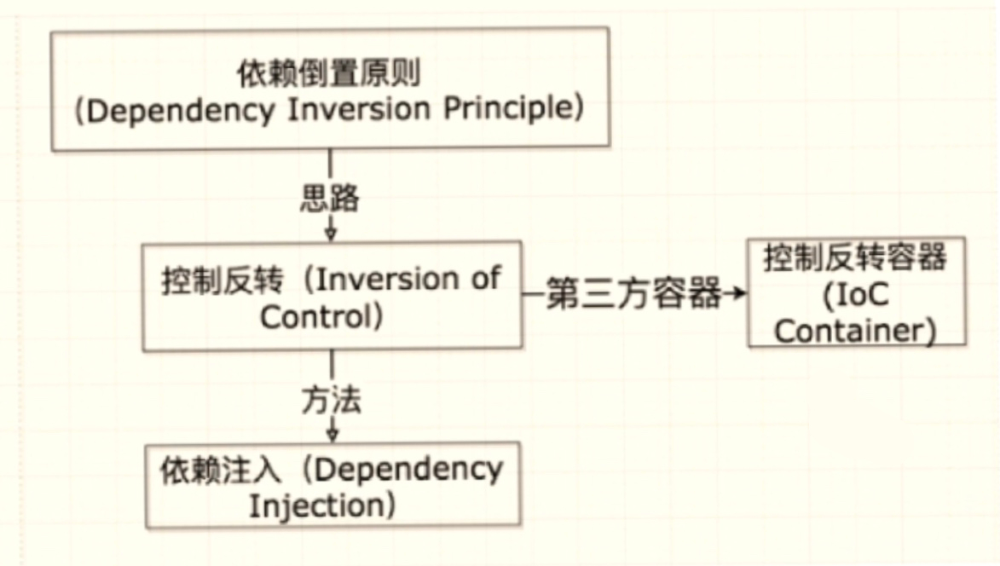

# Spring IOC

## SpringIOC原理

### DI (Dependency Inject，依赖注入)

**举例：设计行李箱**

- 最初的思想：依赖，上层设计依赖于下层设计，下层控制上层。

  `轮子`  <---依赖---   `底盘`   <---依赖---  `箱体`  <---依赖---  `行李箱`

  
  

这种方式的缺点在于，上层设计依赖于下层设计，修改下层，之上的上层都需要修改。 

 

- DI设计思想：依赖注入，控制反转(IoC)，把底层类作为参数传递给上层类，实现上层对下层的控制。

  `轮子`  ---注入--->  `底盘`  ---注入--->  `箱体` ---注入--->  `行李箱`

  

- DI 方式

  - Setter Injection Set注入
  - Interface Injection 接口注入
  - Annotation Injection 注解注入
  - Constructor Injection 构造器注入


### 依赖倒置原则，IOC， DI，IOC容器的关系



### IOC容器优势

- 避免在各处使用`new`创建类，并且可以做到统一维护；

  自动初始化，只需要维护configuration即可

- 创建实例的时候，不需要了解其中的细节；

  不需要知道里面的实例是如何创建的，类似一个工厂

## SpringIOC应用

- 读取Bean配置信息
- 根据Bean注册表实例化Bean
- 将Bean实例放入Spring容器中
- 应用程序使用Bean

#### SpringIOC支持

- **依赖注入**
- 依赖检查
- **自动装配**
- 支持集合
- 指定初始化方法和销毁方法
- 支持回调方法

#### SpringIOC容器的核心接口

- BeanFactory
- ApplicationContext

#### BeanDefinition

- 主要用于描述Bean的定义

  ```xml
  <!-- 配置事务管理器 -->
  <bean id="transactionManager" class="org.springframework.jdbc.datasource.DataSource.TransactionManager">
  	<!-- 注入数据库连接池 -->
      <property name="dateSource" ref="dateSource" />
  </bean>
  ```

  ```java
  @Service
  public class MyService {
      @Autowired
      private ConnectionSettings connection;
      // ..
      
      public void openConnection() {
          connection.connect();
      }
  }
  ```

#### BeanDefinitionRegistry

- 提供向IOC容器注册BeanDefinition对象的方法

### BeanFactory

单例存在的

Spring框架最核心的接口

- 提供IOC的配置机制
- 包含Bean的各种定义，便于实例化Bean
- 建立Bean之间的依赖关系
- Bean生命周期的控制

### BeanFactory和ApplicationContext的比较

- BeanFactory是Spring框架的基础设施，面向Spring
- ApplicationContext面向使用Spring框架的开发者
- ApplicationContext包含BeanFactory，可以称为高级容器

### ApplicationContext的功能(应用上下文)

- BeanFactory：能够管理、装配Bean
- ResourcePatternResolver：能够加载资源文件
- MessageSourceL：能够实现国际化等功能
- ApplicationEventPublisher：能够注册监听器，实现监听机制

### 应用

- @Componet  最普通的组件，可以被注入到spring容器进行管理
- @ComponetScan 扫描组件，已集成于@SpringBootApplication
- @Bean  注册Bean对象
- @Autowired 自动注入
- @Configuration 配置spring容器(应用上下文)
- @Primary 多个组件

## Bean

### getBean

​	方法代码逻辑

- 转换beanName
- 从缓存中加载实例
- 实例化Bean
- 检测parentBeanFactory
- 初始化依赖的Bean
- 创建Bean

### Bean的作用域

- singleton：Spring的默认作用域，容器里拥有唯一的Bean实例，作用于有状态的Bean
- prototype：针对每个getBean请求，容器都会创建一个Bean实例，作用于无状态的Bean，需要创建和销毁，有额外的开销
- request：对每个Http请求创建一个Bean实例
- session：对每个Session创建一个Bean实例
- globalSession：为每个全局HttpSession创建一个Bean实例，该作用域仅对Portlet有效，(PortletContext)

### Spring Bean的生命周期

由容器管理

- 创建过程：
  - 实例化Bean，设置Bean属性
  - Aware（注入Bean ID，BeanFactory和AppCtx），设定对容器的感知
  - BeanPostProcessor(s).postProcessBeforeInitialization，对实例化的Bean做处理的逻辑
  - InitializingBean(s).afterPropertiesSet，属性设置之后自定义的操作
  - 定制Bean init方法，初始化
  - BeanPostProcessor(s).postProcessAfterInitialization，实例初始化之后的自定义操作
  - Bean初始化完毕
- 销毁过程
  - 若实现了DisposableBean接口，则会调用destroy方法
  - 若配置了destroy-method属性，则会调用其配置的销毁方法

