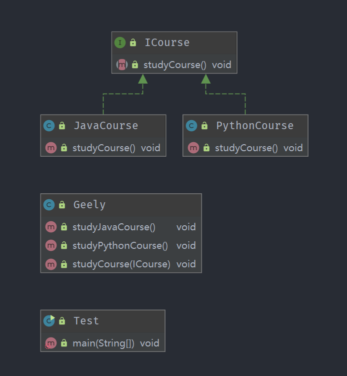
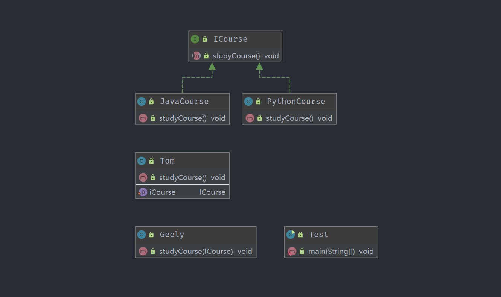
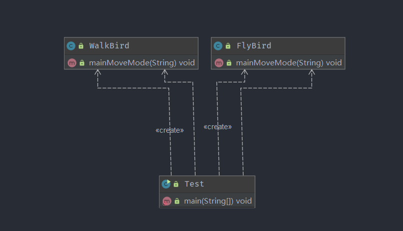
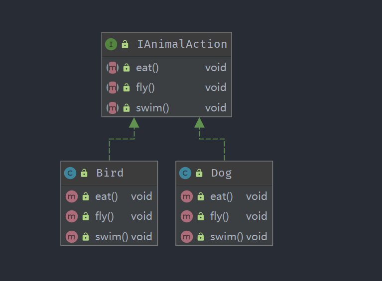
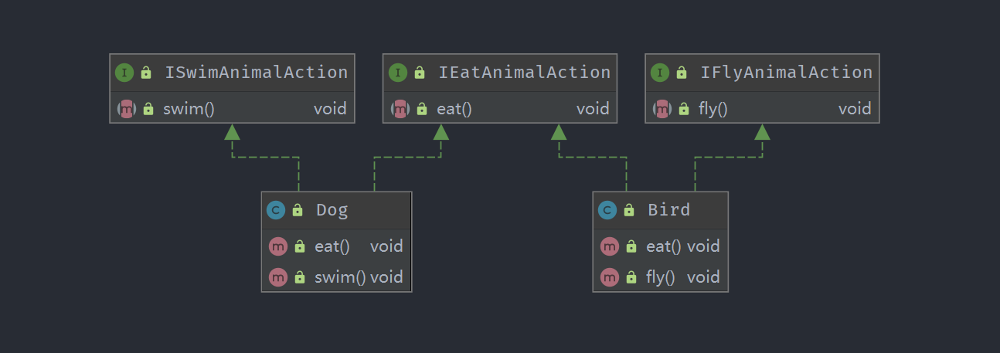
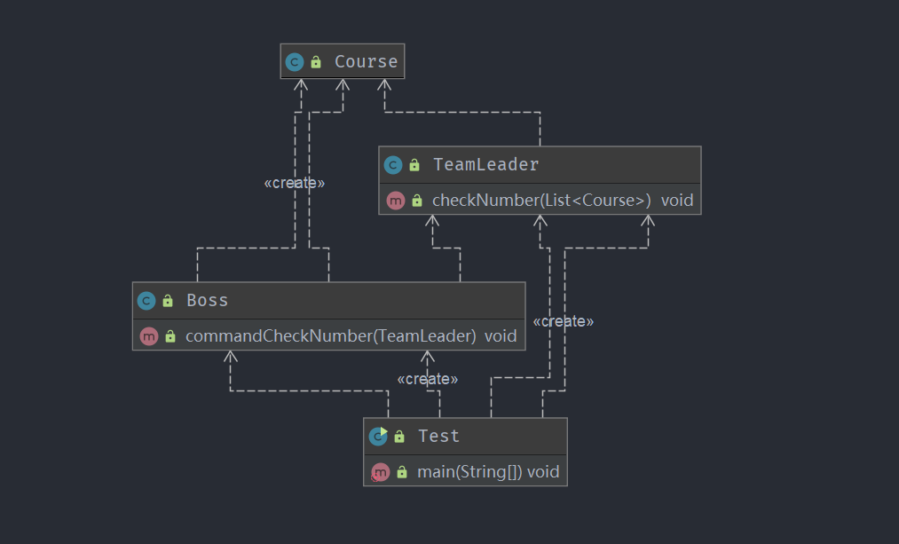
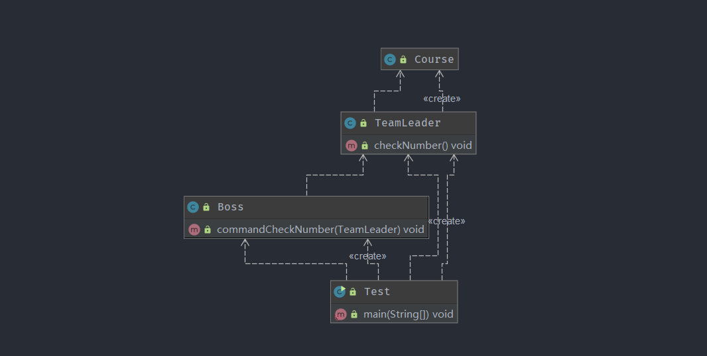
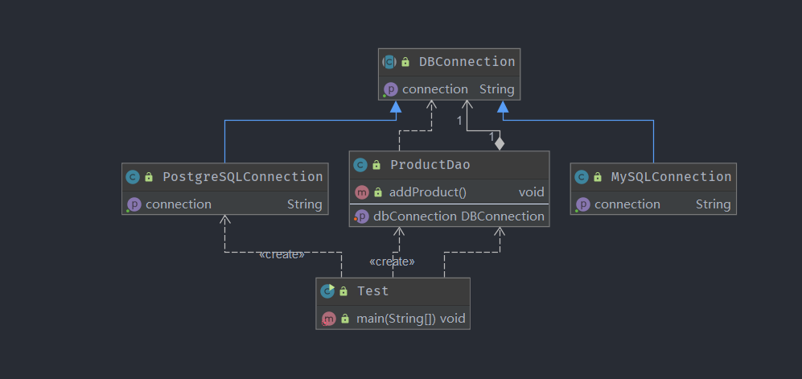

# 软件设计原则

## 开闭原则

### 定义：

一个软件实体如类、模块和函数应该对扩展开放，对修改关闭

用抽象构建框架，用实现扩展细节

### 优点：

提高软件系统的复用性和可维护性

### 细节：

面向对象编程中最基本的设计原则

系统的版本更新，尽量不修改源代码，但是可以增加新功能

核心思想 就是面向抽象编程

实现新功能，尽量不要修改原有代码的逻辑

是最重要的软件设计原则，其余的几大原则都是为了实现这一原则，开闭原则相当于它们的主旨思想

## 依赖倒置原则 (Dependency inversion principle，DIP)

### 定义：

高层模块不应该依赖底层模块，二者都应该依赖其抽象

抽象不应该依赖细节；细节应该依赖抽象

针对接口编程，不要针对实现编程

每个类尽量实现接口或者继承抽象类，或者同时实现接口和继承抽象类

### 优点：

可以减少类间的耦合性，提高系统的稳定性，提高代码的可读性和可维护性，可降低修改程序所造成的风险

### Coding：

#### 通过接口注入参数的方法

- 一个课程接口

```java
public interface ICourse {
	void studyCourse();
}
```

- 实现接口的类

```java
public class JavaCourse implements ICourse {
	
	@Override
	public void studyCourse() {
		System.out.println("Geely study Java");
	}
}
```

```java
public class PythonCourse implements ICourse {
	@Override
	public void studyCourse() {
		System.out.println("Geely study Python");
	}
}
```

- 具体的业务实现类

```java
public class Geely {
    // 最初每个课程都需要一个方法
	public void studyJavaCourse() {
		System.out.println("Geely study Java");
	}	
	public void studyPythonCourse() {
		System.out.println("Geely study Python");
	}
	
    // 现在只需要通过实现接口的类即可
	public void studyCourse(ICourse iCourse) {
		iCourse.studyCourse();
	}
}
```

- Test

```java
public class Test {
	
	public static void main(String[] args) {
		
		// v1
        // 每个课程都需要实现一个方法
        // 修改扩展不方便，每个用户都要修改一次
		Geely geely = new Geely();
		geely.studyJavaCourse();
		geely.studyPythonCourse();
		
		// v2
        // 传入参数，实现接口的类
		geely.studyCourse(new JavaCourse());
		geely.studyCourse(new PythonCourse());
	}
}
```

- 类图



#### 通过setter注入参数

- 一个课程接口

```java
public interface ICourse {
	void studyCourse();
}
```

- 实现接口的类

```java
public class JavaCourse implements ICourse {	
	@Override
	public void studyCourse() {
		System.out.println("Geely study Java");
	}
}
```

```java
public class PythonCourse implements ICourse {
	@Override
	public void studyCourse() {
		System.out.println("Geely study Python");
	}
}
```

- 具体的业务实现类

```java
public class Tom {      
    private ICourse iCourse;     
    public void setiCourse(ICourse iCourse) { 
        this.iCourse = iCourse;   
    }      
    public void studyCourse() {    
        iCourse.studyCourse();  
    }
}
```

- Test

```java
public class Test {
	
	public static void main(String[] args) {
		
		Tom tom = new Tom();
		tom.setiCourse(new JavaCourse());
		tom.studyCourse();
		
		tom.setiCourse(new PythonCourse());
		tom.studyCourse();
	}
}
```

- 类图



## 单一职责原则

### 定义：

不要存在多于一个导致类变更的原因

### 主要强调：

一个类/接口/方法，只负责一项职责

### 优点：

降低类的复杂度、提高类的可读性、提高系统的可维护性、降低变更引起的风险

### 解析：

实际开发中，尽量保证接口/方法实现单一原则，把接口/方法拆分，类实现单一的话，很容易引起类太对

### Coding：

- 未使用单一职责原则

每次添加新的需求都需要修改Bird类，出现问题的风险很大

```java
public class Bird {
	public void mainMoveMode(String birdName) {
		if ("鸵鸟".equals(birdName)) {
			System.out.println(birdName + "用脚走");
		} else {
			System.out.println(birdName + "用翅膀飞");
		}
	}
}
```

```java
public class Test {
	public static void main(String[] args) {
		Bird bird = new Bird();
		bird.mainMoveMode("大雁");
		bird.mainMoveMode("鸵鸟");
	}
}
```

- 使用单一职责原则

修改/新增一个功能，都是在自身下修改，不影响其他的功能

```java
public class FlyBird {
	public void mainMoveMode(String birdName) {
		System.out.println(birdName + "用翅膀飞");
	}
}
```

```java
public class WalkBird {
	public void mainMoveMode(String birdName) {
		System.out.println(birdName + "用脚走");
	}
}
```

```java
public class Test {
	public static void main(String[] args) {	
		FlyBird flyBird = new FlyBird();
		flyBird.mainMoveMode("大雁");
		WalkBird walkBird = new WalkBird();
		walkBird.mainMoveMode("鸵鸟");
	}
}
```

- 类图



## 接口隔离原则

### 定义：

用多个专门的接口，而不使用单一的总接口，客户端不应该依赖它不需要的接口

### 主要强调：

一个类对一个类的依赖，应该建立在最小的接口上

建立单一接口，不要建立庞大臃肿的接口

尽量细化接口，接口中的方法尽量少

注意适度原则，一定要适度

### 优点：

符合高内聚、低耦合的设计思想；

类具有很好的可读性、可扩展性和可维护性

### Coding：

#### 未使用接口隔离原则：

有接口的方法是空实现，接口声明的过多。没有做到接口隔离

```java
public interface IAnimalAction {
	void eat();
	void fly();
	void swim();
}
```

```java
public class Dog implements IAnimalAction {
	@Override
	public void eat() {
	
	}
	
	@Override
	public void fly() {
	
	}
	
	@Override
	public void swim() {
	
	}
}
```

```java
public class Bird implements IAnimalAction {
	@Override
	public void eat() {
	
	}
	
	@Override
	public void fly() {
	
	}
	
	@Override
	public void swim() {
	
	}
}
```

类图：



#### 使用接口隔离原则

接口设计的需要适量，用最少的方法，实现最多的功能。

把Action分散成三个不同的接口，可以预防外来变更的扩展，提高的系统的灵活性和可维护性

```java
public interface IEatAnimalAction {
	void eat();
}
```

```java
public interface IFlyAnimalAction {
	void fly();
}
```

```java
public interface ISwimAnimalAction {
	void swim();
}
```

```java
public class Dog implements IEatAnimalAction, ISwimAnimalAction {
	@Override
	public void eat() {
	
	}
	
	@Override
	public void swim() {
	
	}
}
```

```java
public class Bird implements IEatAnimalAction, IFlyAnimalAction {
	
	@Override
	public void eat() {
	
	}
	
	@Override
	public void fly() {
	
	}
}
```

类图：



## 迪米特原则

### 定义：

一个对象应该对其他对象保持最少的了解。又叫最少知道原则。

### 细节：

尽量降低类与类之间的耦合

强调只和 `朋友` 交流，不和 `陌生人` 说话

朋友是指：出现在成员变量、方法的输入、输出参数中的类称为成员朋友类；而出现在方法体内部的类不属于朋友类

### 优点：

降低类之间的耦合

### Coding：

- 未遵循迪米特法则

对于Boss类来说，朋友是TeamLeader，void，方法中的Course不是朋友

对于TeamLeader类来说，Course是朋友

使用迪米特法则，改进应该把Course放入TeamLeader类中

```java
public class Boss {
	public void commandCheckNumber(TeamLeader teamLeader) {
		List<Course> courseList = new ArrayList<>();
		for (int i = 0; i < 20; i++) {
			courseList.add(new Course());
		}
		teamLeader.checkNumber(courseList);
	}
}
```

```java
public class TeamLeader {
	public void checkNumber(List<Course> courseList) {
		System.out.println("课程数: " + courseList.size());
	}
}
```

```java
public class Course {
    
}
```

```java
public class Test {
	public static void main(String[] args) {
		Boss boss = new Boss();
		TeamLeader teamLeader = new TeamLeader();
		boss.commandCheckNumber(teamLeader);
		
	}
}
```

类图：



- 遵循迪米特法则：

```java
public class Boss {
	public void commandCheckNumber(TeamLeader teamLeader) {
		
		teamLeader.checkNumber();
	}
}
```

```java
public class TeamLeader {
	public void checkNumber() {
		List<Course> courseList = new ArrayList<>();
		for (int i = 0; i < 20; i++) {
			courseList.add(new Course());
		}
		System.out.println("课程数: " + courseList.size());
	}
}
```

```java
public class Course {
}
```

```java
public class Test {
	public static void main(String[] args) {
		Boss boss = new Boss();
		TeamLeader teamLeader = new TeamLeader();
		boss.commandCheckNumber(teamLeader);
		
	}
}
```

类图：



## 里氏替换原则：

### 定义：

如果对每一个类型为T1的对象o1，都有类型为T2的对象o2，使得以T1定义的所有程序P在所有的对象o1都替换成o2时，程序P的行为没有发生变化，那么类型T2是类型T1的子类型

### 定义扩展：

一个软件实体如果适用一个父类的话，那一定适用于其子类，所有引用父类的地方，必须能透明地使用其子类的对象，子类对象替换父类对象，而程序逻辑不变

### 引申意义：

1. 子类可以扩展父类的功能，但不能改变父类原有的功能；

2. 子类可以实现父类的抽象方法，但不能覆盖父类的非抽象方法；

3. 子类中可以增加自己特有的方法

4. 当子类的方法重载父类的方法时，方法的前置条件（即方法的入参/输入）要比父类方法的输入参数更宽松：【父类的入参为HashMap，子类的入参应为Map】
5. 当子类的方法实现父类的方法时（重写/重载或实现抽象方法），方法的后置条件（即方法的输出/返回值）要比父类更严格或者相等：【父类的返回值为Map，子类的返回值要么是Map，要么可以是HashMap】

### 优点：

1. 约束继承泛滥，是开闭原则的一种体现
2. 加强程序的健壮性，同时变更时也可以做到非常好的兼容性，提高程序的维护性、扩展性，降低需求变更时引入的风险

### Coding：

- 参数输入

父类

```java
public class Base {
	public void method(HashMap hashMap) {
		System.out.println("父类被执行");
	}
}
```

子类

```java
public class Child extends Base {
//  重载  
//	@Override
//	public void method(HashMap hashMap) {
//		System.out.println("子类HashMap被执行");
//	}
//
//  重写    
	public void method(Map map) {
		System.out.println("子类Map被执行");
	}
}
```

```java
public class Test {
	public static void main(String[] args) {
		Child child = new Child();
		HashMap hashMap = new HashMap();
		Map map = new HashMap();
		child.method(hashMap);
		child.method(map);
	}
}
```

- 返回值

父类

```java
public abstract class Base {
	public abstract Map method();
}
```

子类

```java
public class Child extends Base {
	@Override
	public HashMap method() {
		HashMap hashMap = new HashMap(2);
		System.out.println("子类被执行HashMap");
		hashMap.put("message", "子类被执行HashMap");
		return hashMap;
	}
}
```

```java
public class Test {
	public static void main(String[] args) {
		Child child = new Child();
		System.out.println(child.method());
	}
}
```

## 组合复用原则：

### 定义：

尽量使用对象组合/聚合，而不是继承关系达到软件复用的目的

### 优点：

可以使系统更加灵活，降低类与类之间的耦合度，一个类的变化对其他类造成的影响相对较少

### 细节：

聚合has-A

组合contains-A

继承is-A

### Coding：

```java
public abstract class DBConnection {
//	public String getConnection() {
//		return "MySQL Connection";
//	}
	
	public abstract String getConnection();
}
```

```java
public class MySQLConnection extends DBConnection {
	@Override
	public String getConnection() {
		return "MySQL Connection";
	}
}
```

```java
public class PostgreSQLConnection extends DBConnection {
	@Override
	public String getConnection() {
		return "PostgreSQL Connection";
	}
}
```

```java
public class ProductDao  {
	private DBConnection dbConnection;
	
    // setter注入
	public void setDbConnection(DBConnection dbConnection) {
		this.dbConnection = dbConnection;
	}
	
	public void addProduct() {
		String conn = dbConnection.getConnection();
		System.out.println(conn);
	}
}
```

```java
public class Test {
	public static void main(String[] args) {
		ProductDao productDao = new ProductDao();
		productDao.setDbConnection(new PostgreSQLConnection());
		productDao.addProduct();
	}
}
```

类图：



